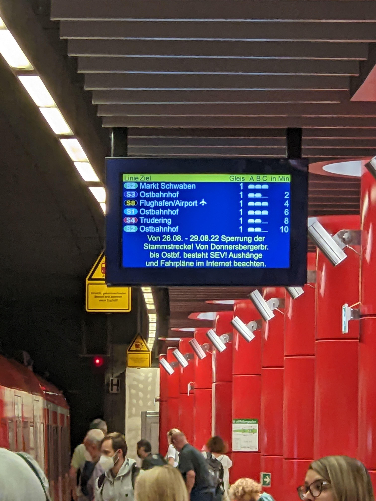
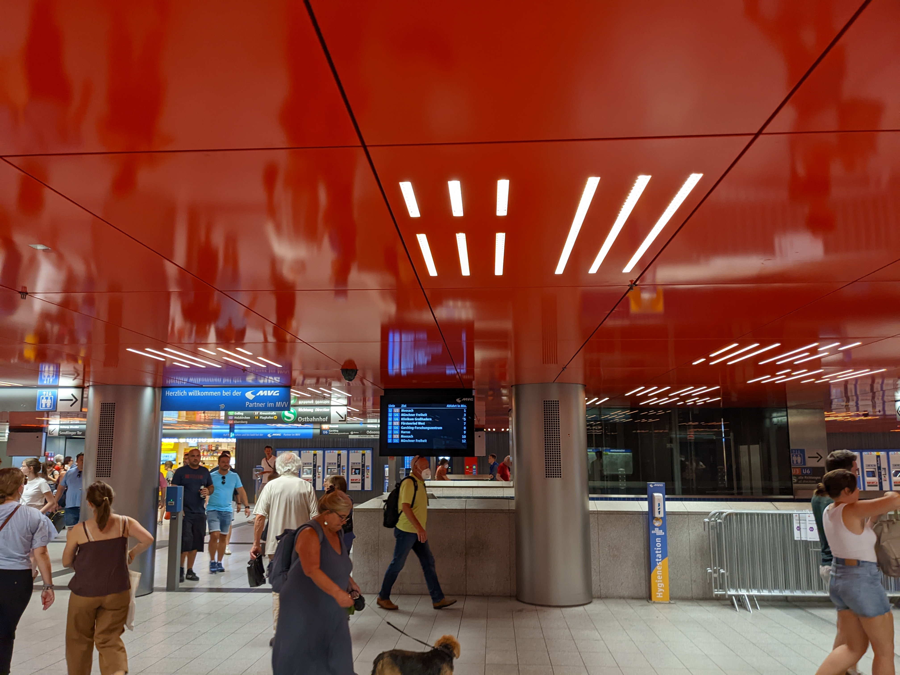
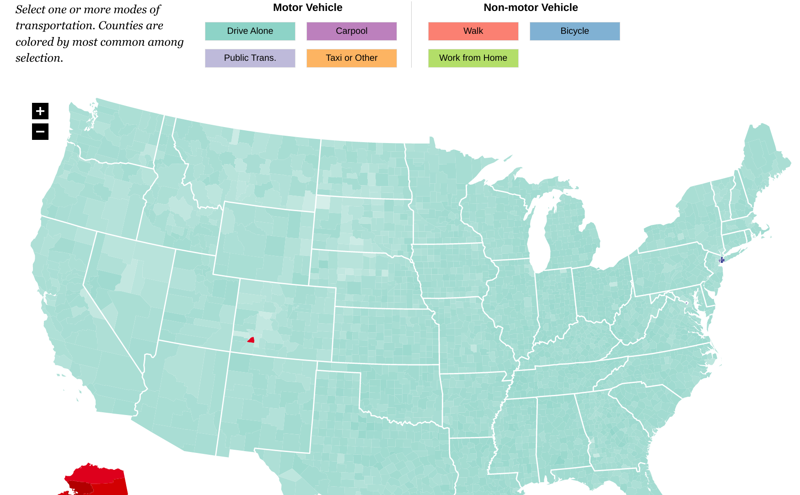

<!--
    fleker.medium.com
    Image: Munich train at sunset
    Description:
        TBD
-->

# Why can't American cities be like Zurich or Munich? Socialism.

Wow Nick, that's a really bold claim. Are you saying Zurich is a better city because they've adopted socialism?

No, actually I'm going to state that America is more socialist and that's what is holding back the country.

When I say socialism, there is definitely [an academic definition](https://en.wikipedia.org/wiki/Socialism). But here I'm going to define it as a mix of political incompetence and anti-capitalist sentiment. That would make for a longer title, and it would be less click-baity.

I traveled recently to central Europe for work. It was all too brief and I do want to go for a longer time. Experiencing the city at night, I saw that these cities were designed well and it was easy to get around.

<blockquote class="twitter-tweet">
Sitting on a lively Parisian street, enjoying a beer at a street cafe, just generally immensely enjoying the ambiance, regretting not having this in the US, and getting mad that I have to go to another country and learn another language to have this. We could build this!
&mdash; William B. Fuckley (@opinonhaver) <a href="https://twitter.com/opinonhaver/status/1564733493191487488?ref_src=twsrc%5Etfw">August 30, 2022</a></blockquote>

I'm certainly not alone. Many people romanticize European cities for good reason. But there's nothing truly special about Europe. We could have those same things in America, but we don't because of our choices.

## Public Transit

A lot of people drove in Zurich. A lot of people biked. A lot of people used the tram system. They were frequent and on time. People dutifully paid their tickets and got on-board, with a series of transfers allowing you to get anywhere quickly.

In Germany, in part due to [the oil market](https://carnegieendowment.org/2022/07/28/germany-s-energy-crisis-is-bigger-than-gazprom-pub-87594), they've instituted [nine euro passes](https://www.cnn.com/travel/article/germany-9-euro-ticket-ending/index.html) which let you use any rail system throughout the country. I was a beneficiary of this, giving me the ability to tour Munich efficiently.

Multiple trains and subways connect together at various points and run frequently. By the time one leaves, another is already entering the station. They are on-time, frequent, and reliable. It's definitely well worth the nine euros.

The transit centers are very nice. As you travel down each level to your train, you'll find yourself in a mall. You can buy food or other items quickly while you wait for your train, though they run so well you'll hardly have time.

There's a lot of pride taken in travel. The Munich Airport has a great central area you pass through, full of lights and sound, before you head downstairs to take the train the rest of the way.

Additionally, these are quaint cities with beautiful buildings, long histories, fantastic food, and relaxing vibes.

## American Socialism

We cannot have these things in America because we've chosen to create bad institutions that actively prevent us from achieving these goals.

The first problem is around zoning, which prevents us from building many of the same structures that we just complimented. It's not that we've chosen not to create five-story apartment buildings, it's that laws in cities and states make it illegal to even begin the process.

<blockquote class="twitter-tweet">
Gosh this is a useful infographic. <a href="https://t.co/tcpivsqg9W">pic.twitter.com/tcpivsqg9W</a>
&mdash; Noah Smith 🐇🇺🇦 (@Noahpinion) <a href="https://twitter.com/Noahpinion/status/1564771687068880896?ref_src=twsrc%5Etfw">August 31, 2022</a></blockquote>

This leads to the idea of the "missing middle", a whole set of potential housing options which may work for some communities. There's [a housing shortage](https://www.npr.org/2022/07/14/1109345201/theres-a-massive-housing-shortage-across-the-u-s-heres-how-bad-it-is-where-you-l) in this country, where prices are abnormally high and prevent people from buying their first homes. Rents similarly are too high. Markets are simply unable to meet rising demand due to a flurry of [burdensome regulations](https://en.wikipedia.org/wiki/Single-family_zoning) and [intentionally created bureaucracy](https://www.theatlantic.com/ideas/archive/2022/04/local-government-community-input-housing-public-transportation/629625/) to block changes.

Many people would love to have great public transit, but fail to enact policies to reach it. New York City has a density of 27,000 people per square-mile, the densest in the country. That's why it's the only region in the country where the majority of people take public transit to work.

Zoning restrictions actively prevent density. Look at cities like Paris, with 20,000 per square-mile. Zurich and Munich have densities of 2800 and 12,000 per square-mile respectively. They don't feel very dense either, but they are much more dense than most US cities.

With few people, it's not economical to run trains frequently. Poor service in turn worsens demand. The entire project becomes infeasible. There's also massive cost problems, such as the NYC 2nd Ave subway [costing an order of magnitude greater than similar projects](https://www.nytimes.com/2022/08/13/opinion/suraj-patel-nyt-interview.html). The astronomical costs of building these systems means that even fewer can be constructed. Infrastructure dollars are finite, even though they have [high returns on investment](https://www.ase.org/blog/public-transit-has-exceptional-roi-lets-get-board-speed-economic-recovery).

Suburban sprawl hurts the environment; cutting down trees and pulling up green spaces so people can burn fossil fuels as their only option for transportation. Biking and walking can often be [infeasible](https://www.smartcitiesdive.com/ex/sustainablecitiescollective/daunting-challenge-unwalkable-america-excerpted-people-habitat/333351/) or [dangerous](https://chi.streetsblog.org/2022/09/01/once-again-car-centric-streets-contribute-to-death-of-a-child-on-a-bike-julian-medina-14/) if the city isn't designed to accomodate them.

## Embracing capitalism

People may point to the Swiss healthcare system as a reason it is socialist, but there seemed to be a lot of opportunities for privately-owned businesses to succeed. The transit centers above had a number of businesses, many of which were large. McDonalds was just one of the many shops at the Zurich train station. Walking through the city you could see a lot of high-end retailers like Armani.

<blockquote class="twitter-tweet">
One of the most successful pedestrian streets in the world, the Strøget in Copenhagen was filled with cars until a 2 year pilot project in 1962. The opposition argued “no cars means no business” but the street has been a massive retail success, the city’s busiest shopping street. <a href="https://t.co/XJdrBXJqlc">pic.twitter.com/XJdrBXJqlc</a>
&mdash; Brent Toderian (@BrentToderian) <a href="https://twitter.com/BrentToderian/status/1559029123195949056?ref_src=twsrc%5Etfw">August 15, 2022</a></blockquote>

In a dense, walkable city with plenty of transit options, commerce is accelerated. In these desirable cities, we end up enhancing capitalism rather than shunning it. Why should we? Having [a system of commerce based on innovation](https://fleker.medium.com/why-liberal-capitalism-beat-russia-36f2eb02ec69) has made life better. East Germany [has seen plenty of benefits](https://www.statista.com/chart/19903/economic-differences-between-eastern-and-western-germany/).

Having [a fair tax system](https://www.natlawreview.com/article/inflation-reduction-act-overview-new-corporate-minimum-tax) means that corporate profits can be used to benefit the entire region. If we have a system that aligns incentives, we'd want businesses to succeed because we'd succeed. Everyone is in it together rather than in some kind of power struggle.

<blockquote class="twitter-tweet">
If you want to look at how poverty has changed relative to higher poverty lines than $1.90, here is the latest data.   Hickel’s big claim in The Guardian – it couldn’t be more wrong to say that poverty declined – is wrong. <a href="https://t.co/nr5HFD2Xal">pic.twitter.com/nr5HFD2Xal</a>
&mdash; Max Roser (@MaxCRoser) <a href="https://twitter.com/MaxCRoser/status/1378730967645446146?ref_src=twsrc%5Etfw">April 4, 2021</a></blockquote>

The world is wealthier today than before, and we're just getting started. A network of private businesses finding ways to make goods cheaper, through more efficient usage of resources, has led to material gains even with [less land](https://ourworldindata.org/peak-agriculture-land) and [less energy](https://ourworldindata.org/energy-gdp-decoupling). This is good! We should do more of it, and we can through carefully crafted policies that create mutually beneficial deals. It's a means to an end.

New York City has a lot of subway stops but they aren't large commercial centers. There's a few that have a few shops inside, but I don't know of any that look that clean or have that many options. We should! There's plenty of great food in the city that I'd buy while waiting for a train. The MTA can rent space to businesses and [street vendors](http://streetvendor.org/), using that revenue for maintenance and improvements. [Many would be interested](https://ilovetheupperwestside.com/the-carts-are-parked-wafels-dinges-plans-neighborhood-storefront/). Yet I can imagine political opposition in an anti-capitalist bent from a small politically connected group who would be the only ones hurt.

This mindset seems to apply to any sort of private enterprise, even if they're a small local business. In Zurich I saw a lot of grocery stores called [Coop](https://en.wikipedia.org/wiki/Coop_(Switzerland)). As the name implies, it's a large cooperatively owned corporation. The internal structure of a business really doesn't matter as much as its material impact: providing the community with good products at prices they can afford. Coop seems to do that and they've had a lot of commercial success.

<blockquote class="twitter-tweet">
I remember this: <a href="https://twitter.com/DeanPreston?ref_src=twsrc%5Etfw">@DeanPreston</a> blocked hundred of affordable homes for a “racial equity study” that he said would take 6 months  It’s been 26 months, and it turns out the study was a lie to block the affordable housing indefinitely. what a scandal  Left-NIMBYism must be rejected <a href="https://t.co/uV6uIapzTs">https://t.co/uV6uIapzTs</a>
&mdash; sam (@sam_d_1995) <a href="https://twitter.com/sam_d_1995/status/1565026081400180736?ref_src=twsrc%5Etfw">August 31, 2022</a></blockquote>

Housing winds up as one obvious example where anti-capitalist sentiment has permeated into American politics. Affordable housing works financially by giving middle income renters a slightly higher rent to subsidize the lower rents that other tenants pay. If you can combine this with street-level businesses paying rent, you have come up with a system where everybody benefits. Businesses have easy access to consumers, middle income residents have good homes, and poorer tenants have an affordable residence. Poorer tenants may even find work at these new stores.

However, an obsession with preventing developers from profiting results in self-proclaimed socialists from delivering on real results to help the working class. It should be okay that developers can profit from housing. We can all profit.

In the socialist mindset, one person winning is another losing. There is only a fixed number of political positions. You can either win or not. Currying political favor can be more important than results, since you need the endorsement of the higher-ups to go up the ladder. With a [growth mindset](https://www.mindsetworks.com/science/), we can see any number of roles to play in making the city better. You don't have to be in the public sector to help your community. Even the local coffeeshop can serve as a [third place](https://en.wikipedia.org/wiki/Third_place) and gathering spot for the public.

<blockquote class="twitter-tweet">
Last year a record 51 new bills were introduced allowing for Americans to sell home-made food for profit.  The result: new businesses sprouting across the country, including this cool one in Tennessee. <a href="https://t.co/QzXRNX3wZz">https://t.co/QzXRNX3wZz</a> <a href="https://t.co/EkiNnxvabU">pic.twitter.com/EkiNnxvabU</a>
&mdash; Michael Hendrix (@michael_hendrix) <a href="https://twitter.com/michael_hendrix/status/1564389860386938880?ref_src=twsrc%5Etfw">August 29, 2022</a></blockquote>

Yes, the coffeshop sells coffee and they profit from that. Good! It means the coffeeshop is objectively providing net value to the community, in their space and in the people they employ, and that they'll be around for years to come.

<blockquote class="twitter-tweet">
Going to Europe makes US preservation feel even stupider. Entire restaurant and stores live inside of Roman ruins.   But god forbid we modify a house to be functional for modern usage because GW took a shit there.
&mdash; Nia ✨⚡️🌙 (@_johnsonator) <a href="https://twitter.com/_johnsonator/status/1563847332919214080?ref_src=twsrc%5Etfw">August 28, 2022</a></blockquote>

Governments have adopted a number of regulations to restrict commerce and progress. Another such regulation is around historical preseveration. "We can't change this building because of its historical value!" they cry even as they talk about [a parking lot](https://fredschultzblog.net/2019/08/30/preservation-versus-a-parking-lot/).

Yet in dense cities like Munich, you really don't have a choice but to engage with structures created generations prior. The Ratskeller restaurant is in the Marienplatz neighborhood of Munich, in the basement of an old town hall. The building was finished in 1905 and has remained an integral part even as the city changed around it. There's no need to tear it down, but it can still be reused for commercial purposes.

## Actually Europe isn't that great

My trip did not take me to a utopia. These cities certainly were not perfect, and it is valuable to point these out even as the majority of my post lauds them. There are things we can all learn from each other, allowing our communities to grow and improve as a result.

Food is relatively expensive. Granted I didn't spend time in convenience stores, or search for the cheapest options, but I was surprised that even ordering water was tacked onto my bill.

I also found it somewhat difficult to sleep at night. My trip was in the middle of summer and the hotel rooms do not have air conditioning. It was a bit warm all night and certainly didn't make me feel comfortable. Germany is seeing an energy crisis and Europe is seeing [skyrocketing energy prices](https://www.france24.com/en/economy/20220826-europe-s-electricity-prices-hit-record-high-as-supply-cuts-begin-to-bite). So in general [Americans are richer than Europeans](https://noahpinion.substack.com/p/americans-are-generally-richer-than).

<blockquote class="twitter-tweet">
Relaxing the land-use regulations alone that hindered housing supply in *just* NYC, SF, and SJ would have boosted US GDP from 1964-2009 by 36%   😭 😭 <a href="https://t.co/l13QLKm8xK">https://t.co/l13QLKm8xK</a> <a href="https://t.co/Uepurj4tdx">pic.twitter.com/Uepurj4tdx</a>
&mdash; Berk (@AwayBerk) <a href="https://twitter.com/AwayBerk/status/1565061146524237825?ref_src=twsrc%5Etfw">August 31, 2022</a></blockquote>

That makes it an even greater shame that we can't restructure our cities. We have so much wealth now, with so much locked away.

We could improve our commerce by opening the streets to restaurants like what's been done in New York City, giving them more space to serve customers. We can implement econonic systems that enable us to serve the public with good public transit rather than [leaving the roads to single-occupancy vehicles](https://www.nytimes.com/2022/08/18/nyregion/nyc-congestion-pricing-manhattan.html).

Our regulatory systems are currently set up to [prioritize process over results](https://constructionphysics.substack.com/p/how-nepa-works). Socialists use regulations so that no affordable housing is built. Even green energy is blocked [ironically using environmental protection as a reason](https://noahpinion.substack.com/p/americas-top-environmental-groups). Processes and protests mean even[ accessibility improvements](https://patch.com/new-york/upper-east-side-nyc/long-awaited-ues-subway-elevator-pits-neighbors-against-advocates) become long, costly affairs.

Many conservatives disagree with government policies, saying that government doesn't work. Unfortunately, they are often right. Government serves to make projects take longer, become more expensive, and often worse. San Francisco's government has failed to make housing affordable. New York City hasn't been able to [make public transit work for everyone](https://www.vanshnookenraggen.com/_index/2022/07/a-quick-look-at-the-mtas-2025-2044-20-year-needs-assessment/).

But the future is a policy choice! What do we want to choose? What are we afraid of?

## Red Socialism

I am worried about a growing red socialism movement in the country. The Republican party has been overtaken by those who want to use the government to attack private enterprises. A mix of regulations, anti-capitalism rhetoric, and new legislation is striking at our nation's shared wealth and ingenuity.

Politicians in Ohio are attacking [enegry independence](https://ohiocapitaljournal.com/2022/08/23/nine-ohio-counties-ban-wind-solar-projects-under-new-state-law/). The governor of Florida is [going after a local business](https://www.washingtonpost.com/politics/2022/04/13/desantis-disney-dont-say-gay-bill/), one that employs many people in the state, in an attempt to impose government censorship and a culture of fear. In Texas the heart of capitalism, trading shares of businesses between private entities, is causing [many trading firms to be banned due to their private business decisions](https://www.axios.com/2022/08/25/texas-bans-blackrock-ubs-esg-backlash).

Government interference in the way businesses are run? That's socialism. It's not about improving capitalism through more competition or creating new markets. This is malice, pure and simple. Political attacks on our private enterprises is dangerous, creating a culture of fear.

<!-- Libertarian -->

<blockquote class="twitter-tweet">
Yes, indeed. Pointing out this simple truth about democracy is <a href="https://twitter.com/LPNational?ref_src=twsrc%5Etfw">@LPNational</a> fulfilling its purpose, whether you like it or not.<a href="https://t.co/A8UWw77CxU">https://t.co/A8UWw77CxU</a> <a href="https://t.co/jRa1ADJW0s">pic.twitter.com/jRa1ADJW0s</a>
&mdash; Libertarian Party Mises Caucus (@LPMisesCaucus) <a href="https://twitter.com/LPMisesCaucus/status/1565863428463464450?ref_src=twsrc%5Etfw">September 3, 2022</a></blockquote>

The destruction of private markets, culture, and democracy will lead to stagnation in our lives. Nobody will want to innovate: they'll be afraid to or even banned from doing so. The inability to vote will halt all kinds of progress, as authorities will care more about their positions than in material results for the public.

Zurich and Munich may not be utopias, but they are cities that we can achieve if we reexamine the cities we want, seek out measurable policy improvements, and [build a brighter future](https://a16z.com/2020/04/18/its-time-to-build/).

<!-- TODO: NYC Subway malls -->

<!-- I'm certainly not the only person... Add more reading material -->

<!-- 
- racism??
- gov't trust
- homeless
- border system 
- employment? 
- Republicans are right: govt doesn't work
- co-op?
- OMNY 

Visas
- why?
-->