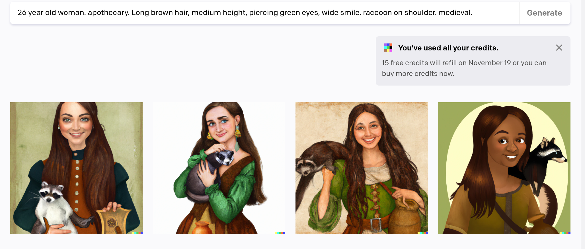

# DALL-E 2 and Prompt Engineering

Hey, I've been writing fantasy novels. I've already published [the first one](https://www.amazon.com/dp/B0BG49NBKG) and I recommend you read it! Sign up for [my author site newsletter](https://felker.page) while you're at it.

As part of this marketing campaign I've authored a series of posts with [illustrations of main characters](https://www.felker.page/p/a-motley-band-of-adventurers-illustrated). I've also done posts on [the royal family](https://www.felker.page/p/the-royalty-in-ernos-illustrated) and [the League of Sorceresses](#). I think this helps the reader imagine the characters and can provide more content for my reader base. 

While I've had the cover designed by a professional, I used [DALL-E 2](https://openai.com/dall-e-2/) for these illustrations. Illustrations are rightly expensive, but I don't think I would've comissioned a bunch of them from an artist. My author budget is constrained, and I think there are higher-impact places to put my limited marketing funds than paid art.

Now that DALL-E 2 [is open for anyone](https://openai.com/blog/dall-e-now-available-without-waitlist/), I thought generating a few illustrations could make good content and it does. In this "behind the scenes" post, I want to give my own experience with the tool and the broader concept of ["prompt engineering"](https://en.wikipedia.org/wiki/Prompt_engineering).

## Text-to-image

DALL-E 2 works just like voice typing: it'll do exactly what you ask of it. You can specify the characters, the location, and even the style of art. It then generates four different takes on the same prompt. Whatever you don't specify, it'll take its own "creative liberties" by filling in its own details. This prompt led to the cover for [my biography on Albert](https://www.felker.page/p/introducing-albert-the-raccoon).

The tool has some "understanding" of various concepts: raccoons, trees, and so on. However, I think a crossbow might've puzzled it in a few examples. As it related crossbow to bows and weapons in general, it added a dagger in the last image.

I found this to be just one example of concepts it didn't quite understand. In these cases, you do get the ability to revise your prompt slightly in order to reach the vision in your head.

You can define a person and a variety of facial features like hair color, eye color, and body shape. The period can also be defined, such as "medieval" to get something that looks similar to that time period. In the example above you see two are photoreal and two are cartoon. Without being explicit, the style might wind up not matching. Sometimes it does.

The tool provides a lot of ambiguity to what it might generate, and prompt engineering is meant to reduce these ambiguities and reach something that's more precise faster. It requires a person to use these tools quite a bit to understand how to make the model do what you want and understand potential pitfalls.

Specifying a time period might override the style, and sometimes DALL-E might shift the skin tone to one you didn't expect. That can be fine [in some circumstances](https://openai.com/blog/reducing-bias-and-improving-safety-in-dall-e-2/) but may require specifying other times.

I eventually discovered that I can append "photograph." at the end to make all the images look real and match a particular style, although DALL-E 2 produced one image that looks old-fashioned. Also it's interesting that by specifying the person as an archer they were always holding a bow. Most of the "photograph"-style images I've produced were against a black backdrop, but other times I just specified it.

## Images of people

While some styles and images are generated with good accuracy, I've noticed photoreal people tend to have a much tougher time. Perhaps that's intentional, to prevent misleading people. The eyes stand out the most, being much too large or small or even both. Pupils are similarly misshapen. The nose might not be straight.

These are potentially things that can be refined through the DALL-E 2 tool or through an image editor. Still, being able to start with something high-quality and fixing a few parts definitely still saves time.

DALL-E 2 can often do exactly what you ask of it. If I ask for a "dragon book" it can literally produce a book with a lizard on the book.

Changing it to a "book with dragon on cover" it does wind up doing something a bit closer in some cases, but there's still no guarantee the dragon will fit in. The blue dragon on a red book was not what I was envisioning. I did like the first photo but it was odd to see a yellow dragon in the background when that's not what I asked.

I revised it to just being an "ancient book" which was something that better suited my vision. You'll note I also added "black background" to the end of the prompt to give a more consistent look. Then I had to pick the best of the four. I didn't quite get why the first image was shifted to the left, but I did see a few generated images that were out of frame. The eyes of the second and fourth looked the weirdest, so I couldn't use them either. The third image was not bad.

Some images are even harder to produce and may require generating more than four images just to find one that does what I want. For example, I wanted an image of a character conjuring a fireball. I thought this could be done with magic, but the tool believed that a candle or a match in their hand would fit the prompt. The second image worked, perhaps influenced by the "magician" and "sorceror hat" phrases.

If I had to do more, I may have tried to specify magic causing the fire. The last image didn't seem to take into account my "thick beard".

In these prompts, I had asked for a scorpion to be on her head but DALL-E 2 didn't seem to understand that. To be fair, it's not quite something that it would expect. The generated images definitely put creepy things on her head, perhaps even creepier than an actual scorpion.

## Conclusion

DALL-E 2 is still improving, and it definitely gave me a number of images that were outright terrible. Still, this experience gave me a greater appreciation of this kind of technology. Once I get a few more free credits I'll continue to play around, taking advantage of my experience to arrive at the perfect image even faster.

If you want to sign up for [my author newsletter](https://felker.page) you'll get updates the next time I post illustrations.
