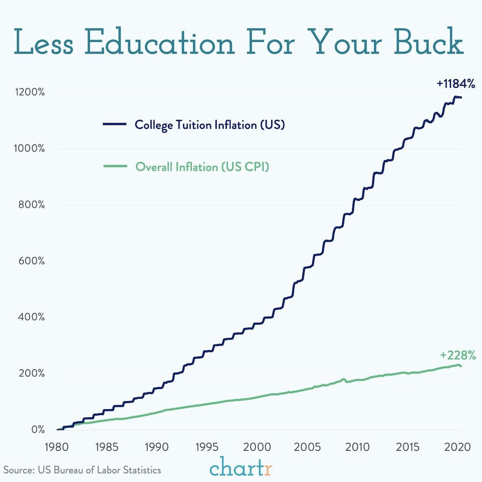
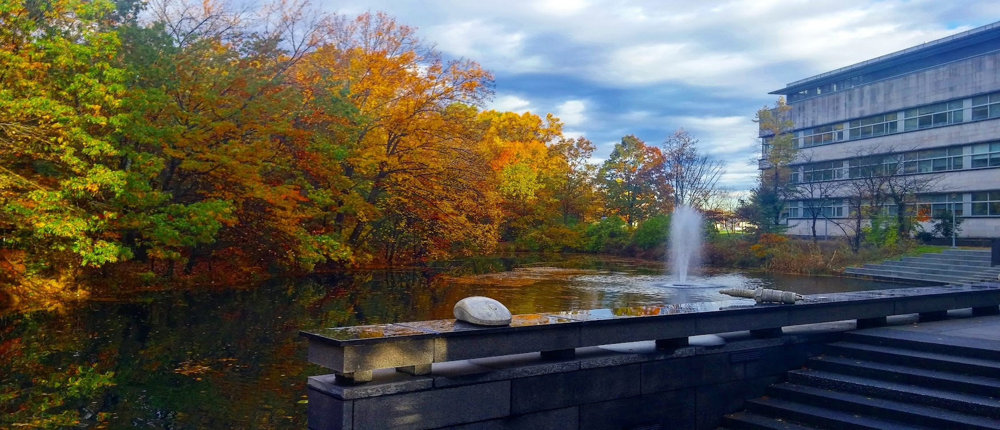
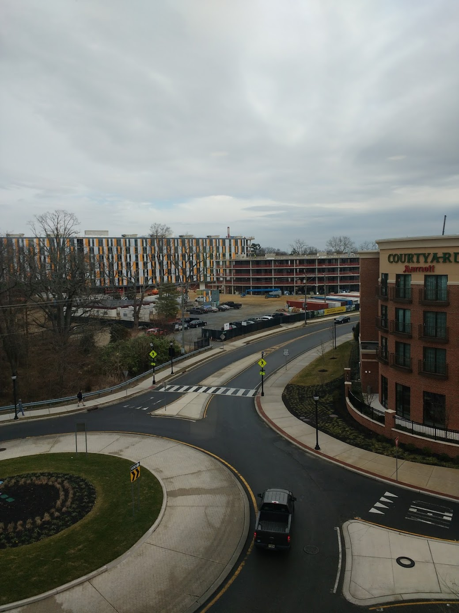
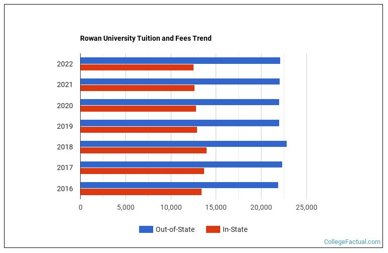
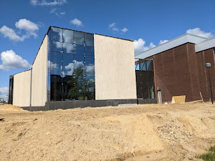

<!--
    fleker.medium.com
    Image:
    Description:
        TBD
-->

# Reducing College Costs with YIMBYism

<!-- TODO Discmlaimer -->

Millions of graduates will soon see [parts of their student loans forgiven](https://studentaid.gov/debt-relief-announcement/). The plan is split in three parts, covering the existing student loan pause, debt relief for lower-income students, and adjusting the income-based payback.

For these people, these policies will bring them plenty of relief and allow them to live without being completely burdened by costs and interest.

However, it does not address the underlying cost problems facing colleges today.

Since 1980, tuition on average has risen by over 1000%. That number may increase if student loan forgiveness creates a [moral hazard](https://www.forbes.com/sites/robertfarrington/2019/06/25/the-moral-hazard-of-student-loan-forgiveness/?sh=17385e90364c), allowing colleges to increase their tuition even more. Meanwhile, colleges are seeing [a large drop in applications](https://thehill.com/changing-america/enrichment/education/3596211-why-a-growing-number-of-young-americans-arent-interested-in-college/) from younger students.

<!-- https://twitter.com/meredithshiner/status/1562191218389716993 -->
<blockquote class="twitter-tweet">
to go to the flagship in-state university in your state is likely half the price of going to a private school, but it&#39;s still an astronomical amount of money and only getting more out-of-reach and could cost you upwards of $100K. Social mobility used to be an attainable thing.
&mdash; Meredith Shiner (@meredithshiner) <a href="https://twitter.com/meredithshiner/status/1562191218389716993?ref_src=twsrc%5Etfw">August 23, 2022</a></blockquote>

Yet there is at least one school whose tuition costs have remained nearly flat for the past half decade. How have they managed to do it, and how can we learn lessons from them?

## Rowan University

Whenever someone asks me where I went to college, I just dismiss them by saying it was a small engineering school in New Jersey. Very few people have actually heard of [Rowan University](https://en.wikipedia.org/wiki/Rowan_University), though for the people living in South Jersey they can't stop hearing about it.

Rowan's growth is, to say the least, staggering. I lived in Glassboro, the home of what was until very recently Glassboro State. It was a relatively small school with a few programs. The education program provided a steady flow of student teachers to the high school across the street.

Glassboro State was never big. It didn't have any recognition beyond its small corner of Jersey, even though it was the place of [a major Cold War Summit between Johnson and Kosygin](https://en.wikipedia.org/wiki/Glassboro_Summit_Conference).

Everything changed when an engineer named Henry Rowan [made a $100 million donation](https://www.goodreads.com/en/book/show/31345289) to Glassboro State to establish an engineering school. A donation of that magnitude led the entire college to be renamed in his honor and in a few years students began graduating with engineering degrees. Malcolm Gladwell tells this story in [an episode of Revisionist History](https://www.pushkin.fm/podcasts/revisionist-history/my-little-hundred-million).

As I grew up in Glassboro at this time, I began to see the effects firsthand. New academic buildings started going up. Large apartment complexes were built. A redevelopment project, called Rowan Boulevard, led to construction of new mixed-use development in a public-private partnership even as the country struggled through the Great Recession.

## Growth

Rowan's growth has been led by its president, [Ali Houshmand](https://sites.rowan.edu/president/biography.html). Since taking the role a decade ago, he has taken strides to turn this university from a small state school to something to take pride in.

It has absorbed two local community colleges: Gloucester County College and Cumberland County College into [Rowan College of South Jersey](https://en.wikipedia.org/wiki/Rowan_College_of_South_Jersey). It has formed multiple medical schools in partnership with [Cooper Hospital](https://en.wikipedia.org/wiki/Cooper_Medical_School_of_Rowan_University) and Virtua Health and has a school for [osteopathic medicine](https://en.wikipedia.org/wiki/Rowan_University_School_of_Osteopathic_Medicine).

Rowan now has [a dinosaur park](https://patch.com/new-jersey/gloucestertownship/73m-nj-fossil-park-will-shed-light-end-dinosaur-era). They've created [the nation's first accredited cannabis business program](https://business.rowan.edu/graduate-programs/programs/mba-program/concentrations1/master-of-business-administration-cannabis-commercialization.html).

In my four years there, its growth was astonishing. The engineering school expanded to a whole new building and a new building opened for business students. Across the street from where I lived, I could see new student housing being built every morning.

Since then, they've added new restaurants, a science building, acquired existing buildings, and plan to grow further. This [transformational leadership](https://www.roi-nj.com/2022/08/24/roi-influencers/higher-education/2022-higher-education/top-presidents/roi-influencers-higher-education-2022-ali-houshmand-3/) has impacted both the college and the town around it.

We can quantify this growth. Since 2010, the number of students [has doubled](https://today.rowan.edu/news/2022/08/proud-to-be-third-fastest-growing.html), going from 11,300 to 23,000 last year.

Amazingly, tuition has remained nearly flat since at least 2016. Tuition has certainly been growing lower than inflation. This is a much different story from the majority of schools around the country who are pushing their students deeper into debt.

What's the catch, you might be wondering. Has this massive growth meant that academics have suffered? No. In fact Rowan's education has improved significantly. Its engineering programs are [among the best in the nation](https://today.rowan.edu/news/2020/09/rowan-engineering-ranks-17-nationally.html).

This success has led to a lot of outside investment and philanthropy. The dinosaur park was from philanthropy, and its upcoming medical school is [a partnership with Virtua Health](https://today.rowan.edu/news/2022/01/rowan-virtua-health-to-create-new-academic-health-system.html), who is funding a large endowment.

Programs that integrate universities, community colleges, and the existing private sector around it allow not just the college to expand while minimizing costs. It has been objectively good for the students. Rowan has received high rankings [in social mobility](https://www.businesswire.com/news/home/20170111005039/en/Rowan-University-is-Selected-as-CollegeNET%E2%80%99s-First-Social-Mobility-Innovator-for-2017), helping lower-income students get a great affordable education and connecting them with good-paying jobs.

## Limits of Growth

That being said, students have definitely experienced a number of growing pains over the years. With the number of students increasing by a thousand each year, various parts of the university have had capacity problems. That housing I photographed above had to be constructed to meet demand, and it was still too slow. My dorm room was a triple, straining the capacity of the room so much we received a $500 check for the burden.

I was lucky, relatively speaking. Some students had to [stay in a hotel](https://www.thewhitonline.com/2019/09/news/rowans-rising-student-population-causes-housing-crisis-for-some/) as the university searched for capacity.

For commuters, parking [has consistently been a problem](https://www.thewhitonline.com/2018/09/news/parking-problems-cause-frustration-across-campus/). As parking lots turn into new buildings, students need to park farther away in fewer spots. Either they can walk or wait for a shuttle, but it's not convenient.

More students connecting to Wi-Fi results in slower speeds. Trying to do anything was frequently frustrating. You'd have to spend a whole class period downloading some software and cross your fingers it would get done in time.

Construction meant loud noises early in the morning or long detours and unsightly lawns. I recently took a photo of the upcoming dance studio, an expansion of the existing music hall. What was once the "Rowan Green" is now a dirt field fenced off, no longer accessible for sitting after a tough exam.

There's plenty of tiny annoyances in growing fast. It's [an annual complaint](https://www.thewhitonline.com/2021/03/opinion/editorial-the-price-we-pay-for-expansion/) in the student paper.

## No Growth

Yet growth is better than none. Across the country, UC Berkeley [was forced to cut admissions](https://timesofsandiego.com/education/2022/03/05/uc-berkeley-enrollment-capped-by-local-residents-lawsuit-but-few-students-are-turned-away/) by residents of the city who complained that their college town had a lot of college students. Losing students means that the rest need to cover the budget shortfall. It means fewer opportunities to engage the local community. It means stagnation at a time when we need to solve the crises of our era and improve social mobility.

Consider Harvard, whose 10% acceptance rate in 2006 [has dropped all the way to 3%](https://www.thecrimson.com/article/2022/4/1/admissions-class-of-2026/). Less than 2000 students are accepted to Harvard every year. Are they a good school? Perhaps. But if they are, then it seems much worse to deny education to the tens of thousands who want it. Harvard students tend to be quite competent, but that's because the selection is so small. So many others are thrown by the wayside to crown a few new elites.

Accepting more students is not the way to better education. Rowan has proved that you can grow in many ways at the same time.

As Harvard's student population has stagnated, [costs have soared](https://www.businessinsider.com/how-the-cost-of-harvard-has-changed-throughout-the-years2019-6). Tuition plus room and board [is roughly $70,000](https://www.thecrimson.com/article/2019/3/29/2019-20-tuition-rise/). While many receive financial aid, those who don't will wind up with staggering amounts of debt.

Harvard is just one college whose unwillingness to grow hurts students twice, rejecting many capable students while simulatanteously charging those admitted ridiculously rising costs.

<blockquote class="twitter-tweet">
Relaxing the land-use regulations alone that hindered housing supply in *just* NYC, SF, and SJ would have boosted US GDP from 1964-2009 by 36%   😭 😭 <a href="https://t.co/l13QLKm8xK">https://t.co/l13QLKm8xK</a> <a href="https://t.co/Uepurj4tdx">pic.twitter.com/Uepurj4tdx</a>
&mdash; Berk (@AwayBerk) <a href="https://twitter.com/AwayBerk/status/1565061146524237825?ref_src=twsrc%5Etfw">August 31, 2022</a></blockquote>

Impeding growth does not just hurt students, who are seeking an education, but the rest of the country too. How many job creators can't start businesses because they never went to business school, or cannot hire enough skilled workers?

## Conclusion

<blockquote class="twitter-tweet">
I remember this: <a href="https://twitter.com/DeanPreston?ref_src=twsrc%5Etfw">@DeanPreston</a> blocked hundred of affordable homes for a “racial equity study” that he said would take 6 months  It’s been 26 months, and it turns out the study was a lie to block the affordable housing indefinitely. what a scandal  Left-NIMBYism must be rejected <a href="https://t.co/uV6uIapzTs">https://t.co/uV6uIapzTs</a>
&mdash; sam (@sam_d_1995) <a href="https://twitter.com/sam_d_1995/status/1565026081400180736?ref_src=twsrc%5Etfw">August 31, 2022</a></blockquote>

We need to say "Yes in my backyard", not just for housing but for education. If we really believe that college is good, we should be investing not just in existing students but in expanding to more. We need to ensure that costs remain affordable and not burdening those just starting in their careers.

College students are often young, but one day they will be given the responsibility to help the next generation of students. Community is more than focusing on today, but ensuring a better tomorrow.

We need [more doctors](https://www.ama-assn.org/practice-management/sustainability/doctor-shortages-are-here-and-they-ll-get-worse-if-we-don-t-act) and [more teachers](https://www.washingtonpost.com/education/2022/08/03/school-teacher-shortage/). Colleges are a necessary step of the process, and they need to play a role in growing to meet the demand today and for our future.
